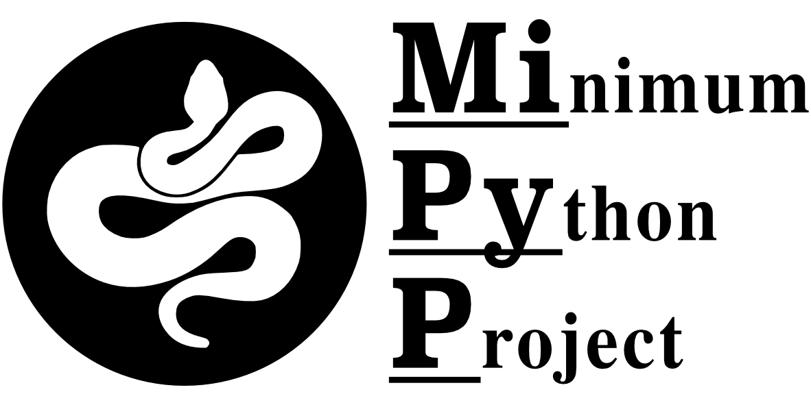

Tutorial
========

^^^^^

**MiPyP** provides researchers with the foundation to build their own
command line bioinformatic toolkits. In this tutorial, we will build a

1. command line toolkit that says 'hello world',
2. construct Sphinx-based documentation, and
3. enable the software to be downloaded from PyPi. 

In this example, we will call our command line tool, mipyp.

0. Setting up your working environment
######################################

^^^^^

Create a new project directory and *cd* into it.

.. code-block:: shell

   $ mkdir my_project
   $ cd my_project

Create a virtual environment, which is an isolated environment for your
python project.

.. code-block:: shell

   $ python3 -m venv .venv

Activate your virtual environment

.. code-block:: shell

    $ source .venv/bin/activate

1. Set up your new project directory
####################################

^^^^^

Download a copy of MiPyP and move it to the present directory. Note,
change your path accordingly for the move command.

.. code-block:: shell

   $ pip3 install mipyp
   $ mv venv/lib/python3.8/site-packages/mipyp/* .

Next, examine the contents of the directory

.. code-block:: shell

   $ ls

